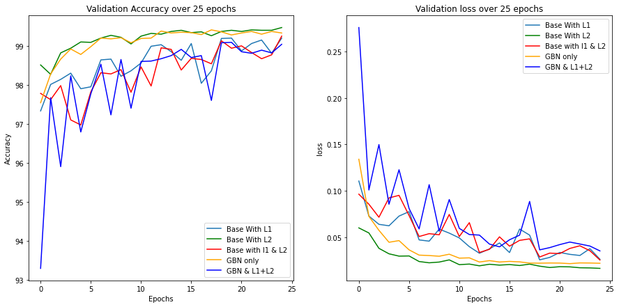
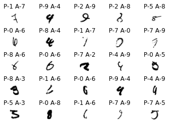

## Work
Working on MNIST data to get to above 99.4% using regularization techniques, Batch Normalizations and Ghost Batch Normalizations techniques

## Data preprocessing 
techniques used 
1. color jitter
2. Normalized
3. random rotation

## Model

Model defintion is defined below

```python
Requirement already satisfied: torchsummary in /usr/local/lib/python3.6/dist-packages (1.5.1)
cuda
----------------------------------------------------------------
        Layer (type)               Output Shape         Param #
================================================================
            Conv2d-1           [-1, 10, 26, 26]              90
              ReLU-2           [-1, 10, 26, 26]               0
       BatchNorm2d-3           [-1, 10, 26, 26]              20
            Conv2d-4           [-1, 16, 24, 24]           1,440
              ReLU-5           [-1, 16, 24, 24]               0
       BatchNorm2d-6           [-1, 16, 24, 24]              32
            Conv2d-7           [-1, 10, 24, 24]             160
       BatchNorm2d-8           [-1, 10, 24, 24]              20
              ReLU-9           [-1, 10, 24, 24]               0
        MaxPool2d-10           [-1, 10, 12, 12]               0
           Conv2d-11           [-1, 10, 10, 10]             900
             ReLU-12           [-1, 10, 10, 10]               0
      BatchNorm2d-13           [-1, 10, 10, 10]              20
           Conv2d-14           [-1, 32, 10, 10]             320
      BatchNorm2d-15           [-1, 32, 10, 10]              64
             ReLU-16           [-1, 32, 10, 10]               0
           Conv2d-17           [-1, 10, 10, 10]             320
             ReLU-18           [-1, 10, 10, 10]               0
      BatchNorm2d-19           [-1, 10, 10, 10]              20
           Conv2d-20             [-1, 10, 8, 8]             900
             ReLU-21             [-1, 10, 8, 8]               0
      BatchNorm2d-22             [-1, 10, 8, 8]              20
           Conv2d-23             [-1, 32, 8, 8]             320
      BatchNorm2d-24             [-1, 32, 8, 8]              64
             ReLU-25             [-1, 32, 8, 8]               0
           Conv2d-26             [-1, 10, 8, 8]             320
             ReLU-27             [-1, 10, 8, 8]               0
      BatchNorm2d-28             [-1, 10, 8, 8]              20
           Conv2d-29             [-1, 14, 6, 6]           1,260
             ReLU-30             [-1, 14, 6, 6]               0
      BatchNorm2d-31             [-1, 14, 6, 6]              28
           Conv2d-32             [-1, 16, 4, 4]           2,016
             ReLU-33             [-1, 16, 4, 4]               0
      BatchNorm2d-34             [-1, 16, 4, 4]              32
        AvgPool2d-35             [-1, 16, 1, 1]               0
           Conv2d-36             [-1, 10, 1, 1]             160
================================================================
Total params: 8,546
Trainable params: 8,546
Non-trainable params: 0
----------------------------------------------------------------
Input size (MB): 0.00
Forward/backward pass size (MB): 0.72
Params size (MB): 0.03
Estimated Total Size (MB): 0.76
----------------------------------------------------------------
```

## Inferences -
1. The best model behaviour(stable and higher accuracy) can be seen with the Base model with L2 regularization followed by base model with just Ghost Batch Normalizations
2. Using L1 and L2 together makes the optimisation process unstable
3. L2 regularization working better than l1 regularization in this case

## Error
1. Model is making an error with close calls like 1 and 7, 4 and 9
2. More regularization techniques can help in gaining the appropriate features to predict

## Validation Accuracy


## Validation loss


## 25 Misclassified images



